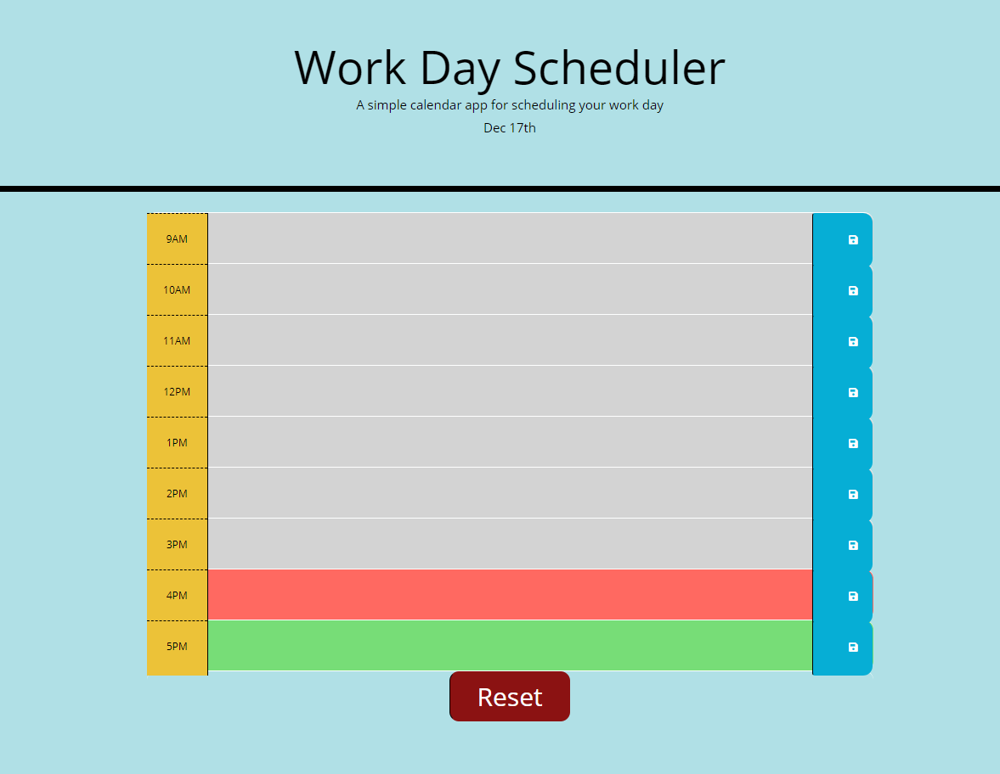

# Work_Day_Scheduler



[Link to site](https://ericchen96.github.io/Code_Quiz/) <br>
[Link to Github repository](https://github.com/EricChen96/Code_Quiz)

## Installation

Go to Github and download

## Description

The following code quiz would create a day plan scheduler. It displays the current date and then any saved descriptions from local storage. 

The user can add a description to each textbox for the hour and click the save button at the right to save that hour's entry. 

## Additions
Added in a reset button that appears on the bottom of the page. When the user clicks on it, it resets all the text inputs back to nothing and clears the stored data.

```
    $(".resetBtn").on("click", reset);

    function reset() {
        descriptionArray = {};
        localStorage.setItem("description", JSON.stringify(descriptionArray));
        for (var hourCount = 9; hourCount < 18; hourCount++) {
            var descriptiongrabEl = $("#hour-" + hourCount + " textarea");
            descriptiongrabEl.val("");
        }
    }
```

## Partners
Collaborated with Elijah Davis, Brandon Craig